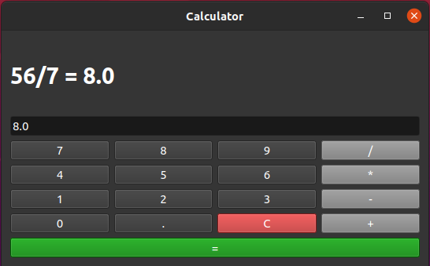

# pyqt5_calculator
# This is a Calculator written in PyQt5.

### It has opportunity to make operation like "+", "-", "*", "/". Also there is a button "C" to clean the screen.

### Added nice dark theme. 
### Implemeted popup window with explanation of errors (DivivsionZeroError, etc)

#View:
